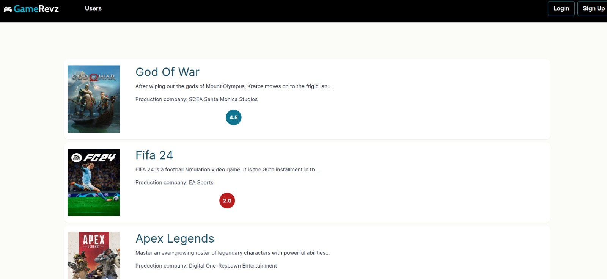
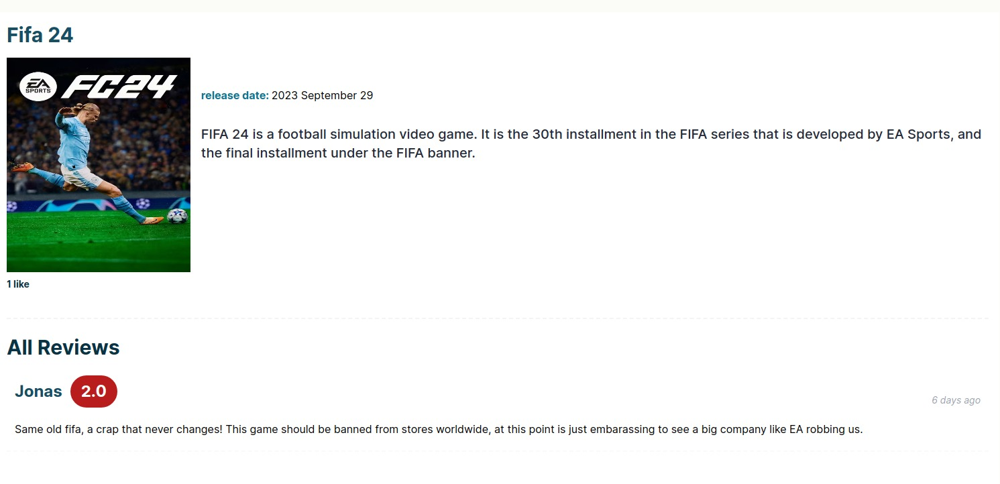
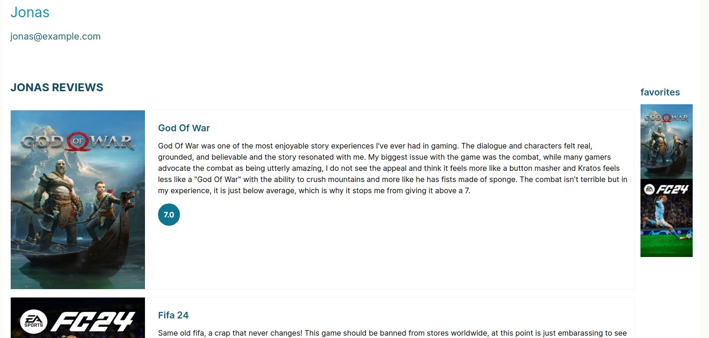
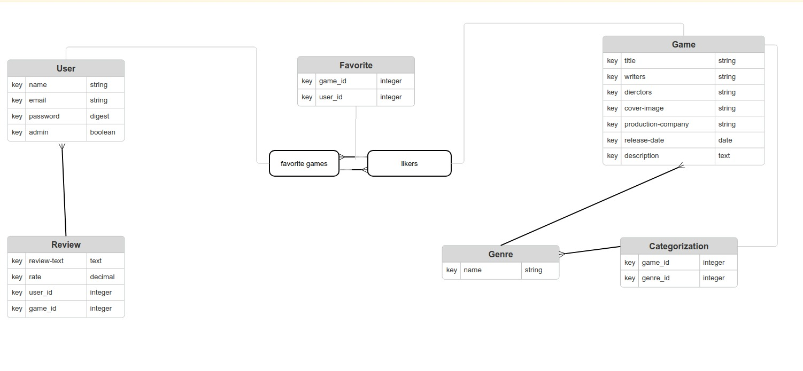

# Gamerevz

## Table of contents

- [About](#about)
- [Features](#features)
- [Live Demo](#live-demo)
- [Presentation](#presentation)
- [Built with](#built-with)
- [Getting started](#getting-started)
  - [Prerequisites](#prerequisites)
  - [Installation instructions](#installation-instructions)
- [Author](#author)
- [Show your support](#show-your-support)
- [Acknowledgements](#acknowledgments)
- [License](#-license)

---

## About

This project is an app where the user can add reviews for games, add games to his favorites, see other user profiles, the admin users can also create, update and delete games.

### Home page



### Game show page



### User show page



## Features

The features of this project are, user can:

1. Register and login to the application.
2. Create, update or delete reviews on games, admins can create, update or delete games.
3. See other users profiles, their favorites and reviews.
4. View game show page and respective reviews and how many likes.
5. Add game to favorites or remove.

## Entity Relational Diagram for this project



## Live Demo

This project is hosted on render.

[Live demo link](https://gamerevz.onrender.com/)

## Presentation

To be done

## Built With

- Ruby v 3.2.0
- Rails v 7.1
- postgresql v 16.4-1

## Getting Started

### Prerequisites

If you intend to download the project, you will need to have

1. Ruby >= 3.2.0

   For more information on how to install Ruby, follow [this link](https://www.ruby-lang.org/en/downloads/)

2. Ruby on rails >= 7.1

   After ruby is installed run cmd `gem  rails`

3. postgresql >= 16.4-1

   For installing postgresql [follow this link](http://postgresguide.com/setup/install.html)

### Installation instructions

Follow along the steps below to get a copy at your local machine.

- Navigate to the directory where you want this project to clone and then clone it

  ```
  git clone git@github.com:helciodev/gamerevz.git
  ```

- Navigate to the `gamerevez` directory

  ```
  cd gamerevz
  ```

- install the gem packages

  ```
  bundle install
  ```

- install yarn packages

  ```
  yarn install
  ```

- Create your database

  ```
  rails db:create
  ```

- Migrate the database

  ```
  rails db:migrate
  ```

- Start your server

  ```
  rails server
  ```

- Open browser at http://localhost:3000/

## Testing

To test the project run the below cmd from your project root directory.

```
rspec

OR

rspec --format doc
```

## Author

😎 **Helcio André**

- GitHub: [@helciodev](https://github.com/helciodev)
- Linkedin: [Helcio Andre](https://www.linkedin.com/in/helcio-andre/)

## 🤝 Contributing

Contributions, issues, and feature requests are welcome!

## Show your support

Give a ⭐️ if you like this project!

## 📝 License

This project is [MIT](./LICENSE) licensed.
